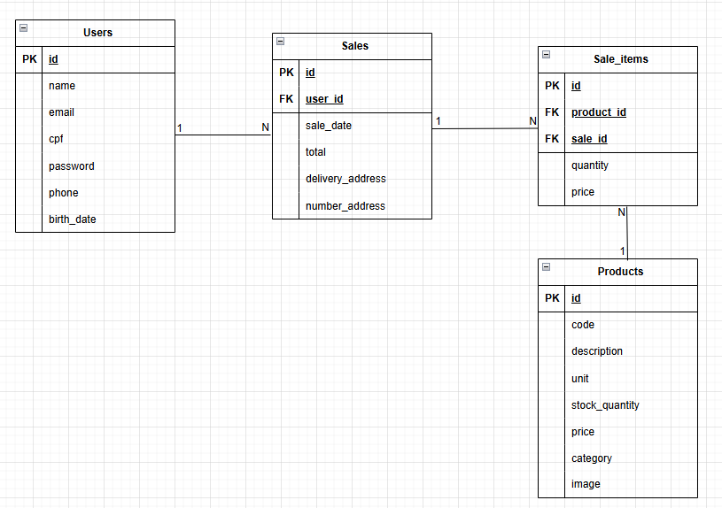

# **E-commerce de Loja de Decoração com PHP (MVC)**

Este é um protótipo de site de venda online de decorações (nome fictício: Decora Fácil), desenvolvido para apresentação na aula de Programação em Scripts da Fatec. O projeto utilizou os aprendizados adquiridos em projetos anteriores ([php-login-mvc-system](https://github.com/Lr0cha/php-login-mvc-system)) e novos conhecimentos adquiridos durante as aulas e estudos extra-classe. Foi adotado o padrão **MVC (Model-View-Controller)**, com foco em boas práticas de segurança, como **hashing de senhas**, **PDO (PHP Data Objects)** para interações com o banco de dados, **validação de entradas** e muito mais.

<a href="https://youtu.be/81at4QJ3fHc" target="_blank">
    <button>Vídeo de apresentação do site</button>
</a>

## **Tecnologias Utilizadas**

- **PHP**: Linguagem de programação utilizada para o desenvolvimento do sistema.
- **MySQL**: Banco de dados relacional para armazenar as informações dos usuários.
- **PDO**: PHP Data Objects, uma maneira segura e flexível de interagir com o banco de dados.
- **HTML/CSS**: Para construção das páginas web e estilização da interface.
- **Bootstrap**: Framework para tornar o layout responsivo e melhorar a estilização com mais agilidade.
- **JavaScript**: Interação dinâmica no client-side, utilizando a ViaCEP e validação de formulários.

## **Funcionalidades**

- **Cadastro de Usuários**: Permite que novos usuários se cadastrem no sistema de maneira segura.
- **Login de Usuários**: Permite que usuários se autentiquem no sistema utilizando e-mail e senha.
- **Sessão de Usuário**: Após o login, o usuário tem acesso à sua área restrita do sistema.
- **Carrinho de Compras**: Após logado, o usuário pode adicionar e remover produtos de seu carrinho de compras.
- **Página de Confirmação**: Exibe os dados do pedido e permite a confirmação do endereço de entrega para finalizar a compra.
- **Busca por Categoria**: Barra de pesquisa com AJAX para interação rápida com os tipos de produtos.
- **Logout**: Permite que o usuário saia da sua sessão.

## Modelagem de Dados
<p align="center">
  
</p>

## **Estrutura do Projeto**

<details>
<summary>Clique para ver a estrutura do projeto</summary>
  
- **Model**: Lógica de negócios, como autenticação de usuários e interações com o banco de dados.
  
- **Controller**: Gerencia as requisições, processa os dados e carrega as views.

- **View**: Páginas HTML que exibem a interface com o usuário.

- **config.php**: Arquivo de configuração, que define o autoload para carregar as classes automaticamente.
- **index.php**: Funciona como o **Front Controller**, lidando com todas as requisições e decidindo qual ação o controlador deve tomar com base na URL ou parâmetros da requisição (como `action=login` ou `action=register`).

</details>

## **Pré-Requisitos**

<details>
<summary>Clique para ver os pré-requisitos</summary>

- **XAMPP** ou **WAMP** (ou outro servidor Apache com PHP e MySQL) instalado.
- Banco de dados MySQL configurado.

</details>

## **Como Configurar**

<details>
<summary>Clique para ver o passo a passo de configuração</summary>

### 1. **Clone o Repositório**

### 2. **Configuração do Banco de Dados**

Crie um banco de dados MySQL chamado `ecommerce` e execute o seguinte SQL para criar a tabela de usuários:

```sql
Script está na pasta trabalho2/database/script.sql
```

### 3. **Configuração do Arquivo `config.php`**

No arquivo `config.php`, você pode ajustar as configurações do banco de dados conforme necessário. Por padrão, está configurado para usar **localhost** e as credenciais padrão do MySQL (usuário: `root`, senha: vazia).

```php
define('HOST', 'localhost');
define('DBNAME', 'ecommerce');
define('USER', 'root');
define('PASSWORD', '');
```

### 4. **Inicie o Servidor Apache e MySQL no XAMPP**

### 5. **Acesse o Sistema**
</details>


